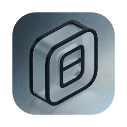

<p align="center">
  
</p>

<h1 align="center">OpenWork-Swift</h1>

<p align="center">
  <strong>Native macOS autonomous AI workbench</strong><br/>
  Swift · SwiftUI · Apple Silicon — no Electron
</p>

<p align="center">
  
  
  
  
  
</p>

<p align="center">
  <a href="#-features">Features</a> ·
  <a href="#-mcp-servers">MCP</a> ·
  <a href="#-architecture">Architecture</a> ·
  <a href="#-requirements">Requirements</a> ·
  <a href="#-build--run">Build</a> ·
  <a href="#-configuration">Config</a> ·
  <a href="#-privacy">Privacy</a>
</p>

---

## Overview

**OpenWork** is a standalone native macOS app for autonomous agents, multi-agent collaboration, scheduled automations, and local/cloud LLM orchestration.

It ships as a real `.app` — UI and tooling sit on system frameworks (`Accelerate`, `Vision`, `PDFKit`, `WebKit`, `Speech`, Keychain). End users who install a build do **not** need Xcode or Swift installed.

Agent tooling aims for **Radiant-class** reliability: official MCP Swift SDK sessions, namespaced first-class MCP tools, native function calling on local MLX and cloud providers, and a multi-turn tool loop that keeps going until the job is done (with sensible guards for local models).

---

## Features

### Autonomous agents

| | Capability |
|:---:|---|
| 🔁 | Multi-turn ReAct with **native tool / function calling** (OpenAI, Ollama, in-process MLX) plus markdown / XML fallbacks |
| 📁 | Filesystem — `file_read`, `file_write`, `edit_file`, `file_list`, `file_copy`, `file_move`, `file_delete` |
| 💻 | Shell — `terminal_command` / `run_command` |
| 🌐 | Network — `fetch_url`, `web_search` |
| 💬 | Interaction — `ask_user`, `exit_plan_mode`, `todo_write` |
| 🧮 | Utilities — `calculator`, `get_current_date`, `document_extract` |
| 📧 | Optional Google — `gmail_*`, `google_calendar_*` |

- Full JSON parameter schemas via `ToolSchemaCatalog` (critical for local-model tool use)
- Context compaction, turn token budget, identical-tool stuck breaker
- **Plan mode** (read-only tools + `exit_plan_mode`)
- Approval gates for destructive / MCP write actions — read-only MCP tools auto-run
- Sub-agent spawning and inter-agent messaging in the Side Inspector
- Clean chat UX: leaked model thinking moves to **Reasoning**, approvals sit **below** the answer, routine MCP status chips stay out of the way

### Local Apple Silicon (MLX) & providers

- **Local Models** tab (On Device / Catalog) for MLX discovery and selection
- Built-in Apple Silicon path (`NativeMLXService` / `LocalMLXEngine`) with real `ToolSpec` + `streamDetails` tool calls
- Optional servers: oMLX, mlx_lm, Osaurus, Ollama, LM Studio
- Cloud & remote: OpenAI-compatible, Anthropic, Groq, OpenRouter, DeepSeek, Mistral, Gemini, custom endpoints
- Provider probing, model listing, Keychain-backed API keys

### Schedules & automations

- Schedules UI with status badges, next run, errors, and footer stats
- Create / edit / Run Now / History / Export / Pause / Resume / Delete
- Watch folders with filesystem triggers and artifact synthesis
- Visual agent flow builder for multi-agent pipelines

### Workspace, skills & desktop UX

- Workspace switcher on the chat header (synced with the sidebar)
- Enabled **Skills** injected into the agent system prompt
- Extensions, prompt templates, slash commands (`/clear`, `/agent`, `/model`, …)
- Local RAG (Accelerate), PDF/Vision extract, live canvas, diffs, terminal, voice STT/TTS
- **Window state persistence** — frame, sidebar & inspector widths, open/closed inspector, navigation destination, settings tab, last workspace & session survive quit/relaunch

---

## MCP servers

OpenWork speaks the [Model Context Protocol](https://modelcontextprotocol.io) with a Radiant-inspired client that prefers **failing soft** over freezing chat.

| | Behavior |
|:---:|---|
| 🔌 | Official MCP Swift SDK stdio client (`MCPSDKSession`) + hand-rolled pipe fallback |
| 🏷️ | Live tools injected as `mcp__{serverId}__{toolName}` |
| ⚡ | Cache-first discovery; background warm-up — chat is **not** blocked on every `npx` cold start |
| ⏱️ | Real deadlines that kill hung connects (structured cancel alone is not enough) |
| 📋 | “What MCP servers are available?” answers from config + live status — **no tool thrash** |
| 🩺 | Settings → Skills & MCP shows connected / error / tool counts; **Test** probes a server |
| 🔒 | Stock servers ship **disabled** — enable only what you trust |
| 🌍 | Remote HTTP MCP with clearer 401 messaging and optional bearer token (`MCP_TOKEN` / headers) |

**MacUse** (mail / calendar-style apps) stays a guided, **read-only** auto-follow:

1. `get_tool_definitions` (e.g. `mail_*`)
2. `call_tool_by_name` → `mail_list_accounts`
3. `call_tool_by_name` → `mail_search_messages`
4. Deterministic inbox summary in chat

Write actions (reply / send / mark-read) are never auto-run.

> Tip: keep [MacUse.app](https://macuse.app) installed and grant Accessibility / Automation when you need write tools. For mail reads, Mail.app can stay closed if MacUse uses its local DB path.

---

## Architecture

```text
OpenWork-Swift/
├── Package.swift / Package.resolved   # SPM deps
├── project.yml                        # XcodeGen
├── OpenWorkSwift.xcodeproj
├── Resources/                         # App icon & assets
├── Tests/
└── Sources/
    ├── App/                 # Entry + window frame autosave
    ├── Models/              # Agent, Workspace, Session, Settings, …
    ├── State/               # AppState
    ├── Storage/             # Persistence, Keychain, WindowLayoutStore
    ├── Engine/
    │   ├── Agents/          # AgentRunner, approvals, compaction, hub
    │   ├── Providers/       # OpenAI, Anthropic, Ollama, NativeMLX, …
    │   ├── Tools/           # Execution, schemas, bounds, docs
    │   ├── MCP/             # MCPClientManager, MCPSDKSession
    │   ├── Integrations/    # Google (Gmail / Calendar)
    │   ├── RAG/ · Terminal/ · Voice/ · Watch/
    └── UI/
        ├── Navigation/      # Sidebar, Spotlight
        ├── Theme/ · Components/
        └── Views/           # Chat, LocalModels, Agents, Automations,
                             # Settings, Inspector, Dashboard, …
```

### Sidebar destinations

| | Destination |
|:---:|---|
| 💬 | Chat & Sessions |
| 🧊 | Local Models |
| 👥 | AI Agents |
| 🖥️ | Model Providers |
| ⚡ | Automations (Schedules) |
| 👁️ | Watch Folders |
| 📂 | Artifacts & Files |
| 🧠 | Memory & Knowledge |
| 🛠️ | Tools & MCP |
| 📊 | Dashboard & Metrics |
| ⚙️ | Settings |

---

## Requirements

| Use case | Need |
|---|---|
| **Run a built `.app`** | macOS 14+ (Sonoma or later); Apple Silicon recommended for MLX |
| **Build from source** | Xcode 15+, Swift 5.9+, macOS 14+ SDK |
| **Optional local servers** | Ollama, LM Studio, oMLX / `mlx-lm`, or Osaurus — only if you use those backends |
| **Optional MacUse MCP** | [MacUse.app](https://macuse.app); Accessibility / Automation for write actions |

Swift / Xcode are **not** required on machines that only install and run a prebuilt app.

---

## Build & run

### Xcode (recommended)

```bash
# Regenerate the project if Sources/ changed
brew install xcodegen   # once
xcodegen generate

open OpenWorkSwift.xcodeproj
```

Select the **OpenWorkSwift** scheme → Build / Run.

> The app target compiles `Sources/` directly and links SPM products from `project.yml` (Yams, MCP, NIO, mlx-swift-lm, Hugging Face, Tokenizers).

### Swift Package Manager

```bash
swift build
swift run OpenWorkSwift
swift test
```

### Install a Debug build (optional)

```bash
# After a successful Debug build:
cp -R ~/Library/Developer/Xcode/DerivedData/OpenWorkSwift-*/Build/Products/Debug/OpenWork.app \
  /Applications/OpenWork.app
```

Quit any running OpenWork instance before replacing the bundle.

---

## Configuration

| | Area | Where / tip |
|:---:|---|---|
| 🔑 | **Providers** | Settings → AI Providers — cloud keys in Keychain; local base URLs for Ollama / LM Studio / MLX servers |
| 🧊 | **Local Models** | Local Models tab — pick an on-device MLX model |
| 🔌 | **MCP** | Settings → Skills & MCP — enable servers, **Refresh Status** / **Test**, restore defaults (disabled) |
| 📬 | **MacUse mail** | e.g. `use the macuse mcp-server and check the mail on this computer` |
| 🤖 | **Agents & skills** | Per-agent tools; enabled skills land in the system prompt |
| 🎛️ | **Advanced** | Plan Mode, Max Turn Tokens, auto context compaction |
| 🗓️ | **Schedules** | Automations — Morning Brief–style prompts, frequency text (`Daily at 6:00 AM`), Run Now |
| 🗂️ | **Workspaces** | Chat header or sidebar — stays synced with the current session |
| 🪟 | **Layout** | Drag splits / move the window — restored automatically next launch |

---

## Privacy

OpenWork is **local-first**. It talks only to LLM endpoints and MCP servers **you** configure. No bundled third-party analytics or telemetry.

---

## License

MIT © 2026 OpenWork
